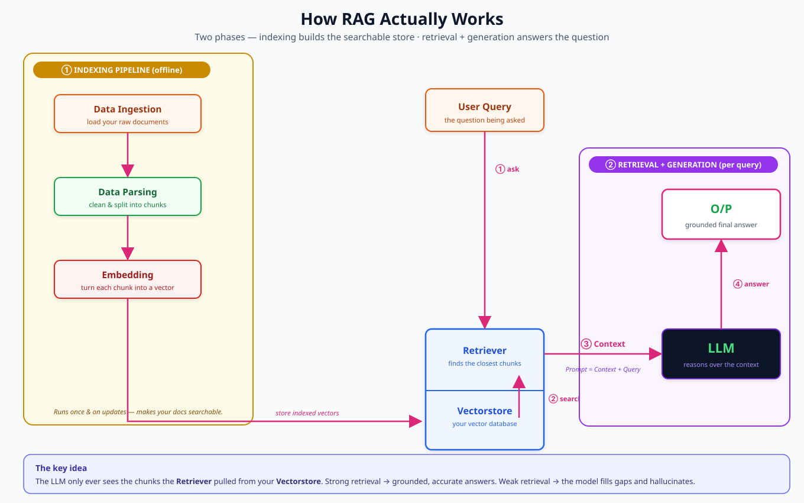

# AI Engineering, Visualized

A growing collection of **clean, from-scratch diagrams** that explain core AI-engineering concepts the way they actually click — not the way textbooks bury them.

Each concept gets its own page: hand-built diagrams first, short plain-English notes second. No walls of text. No jargon without a picture next to it.

> A good diagram beats a good paragraph. This repo is me proving that to myself, one concept at a time.

---

## 📚 Concepts

Full index with every page listed → **[concepts/](concepts/README.md)**

| Concept | Status | In one line |
|---|---|---|
| [Retrieval-Augmented Generation (RAG)](concepts/rag/) | ✅ Live | How an LLM answers questions using *your* data instead of guessing |
| ↳ [Contextual Retrieval](concepts/rag/contextual-retrieval.md) | ✅ Live | Fixing the context that chunking throws away — ~67% fewer retrieval misses |
| Embeddings & Vector Search | 🚧 Planned | Turning text into numbers so machines can find "similar" meaning |
| Chunking Strategies | 🚧 Planned | How you split documents — and why it makes or breaks retrieval |
| Prompt Engineering | 🚧 Planned | Structuring what you send the model to get what you want back |
| Fine-tuning vs RAG | 🚧 Planned | Two ways to specialize a model, and when to reach for each |
| AI Agents & Tool Use | 🚧 Planned | Letting a model take actions, not just answer |
| Model Context Protocol (MCP) | 🚧 Planned | A standard way to plug tools and data into models |
| Evaluating AI Systems | 🚧 Planned | How you actually measure whether any of this works |

---

## ⭐ Featured: RAG

**Retrieval-Augmented Generation** lets a language model reference an authoritative knowledge base *outside its training data* before answering — so responses stay accurate, current, and grounded in your own documents.

**The data flow:**


**How it actually works — the components:**



Full write-up, glossary, and the two-phase breakdown → **[concepts/rag/](concepts/rag/)**

---

## 🧭 How this repo is laid out

Every concept is a self-contained folder — read one without needing any of the others.

```
.
├── README.md              # you are here
└── concepts/
    ├── README.md          # index of every concept and page
    └── rag/
        ├── README.md              # RAG, from zero
        ├── contextual-retrieval.md # deep dive
        └── diagrams/              # every .svg used on the pages above
```

Conventions: folders and files are lowercase `kebab-case`; each concept folder has a `README.md` as its entry point and keeps its diagrams in `diagrams/`.

---

## 🗺️ Roadmap

The plan is to cover the concepts an AI engineer touches weekly, each as a standalone visual page. Concepts get promoted from 🚧 Planned to ✅ Live as diagrams land. Suggestions and corrections welcome — open an issue.

## 🖼️ How the diagrams are made

Every diagram is hand-authored **SVG** — vector, so it stays crisp at any zoom and drops cleanly into notes, slides, or docs. No screenshots, no lock-in. Each `.svg` in this repo is reusable on its own.

## 📄 License

[MIT](LICENSE) — use these freely. A link back is appreciated but not required.
