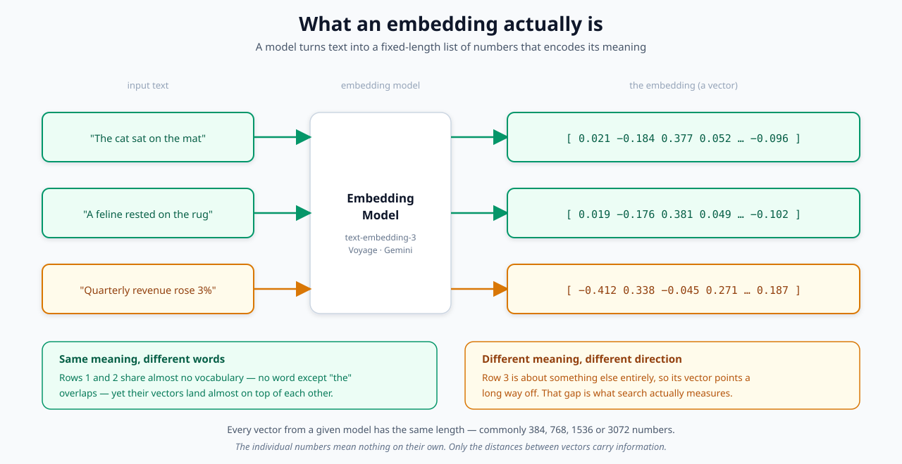
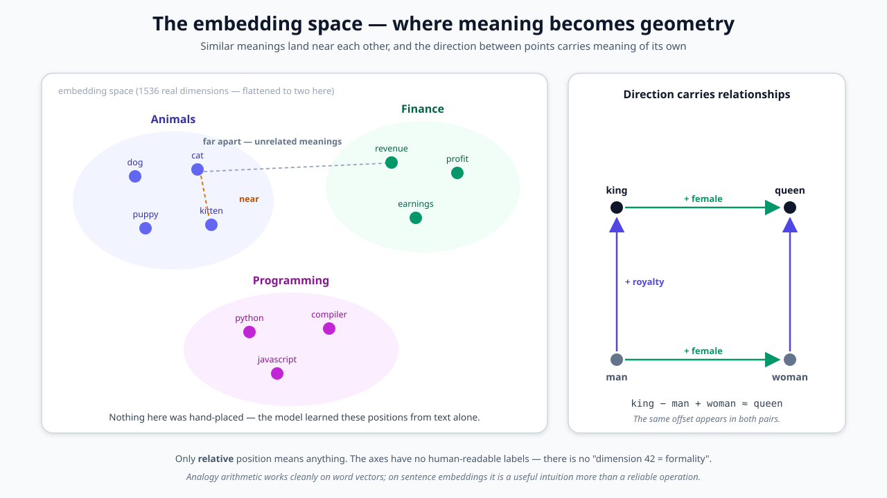
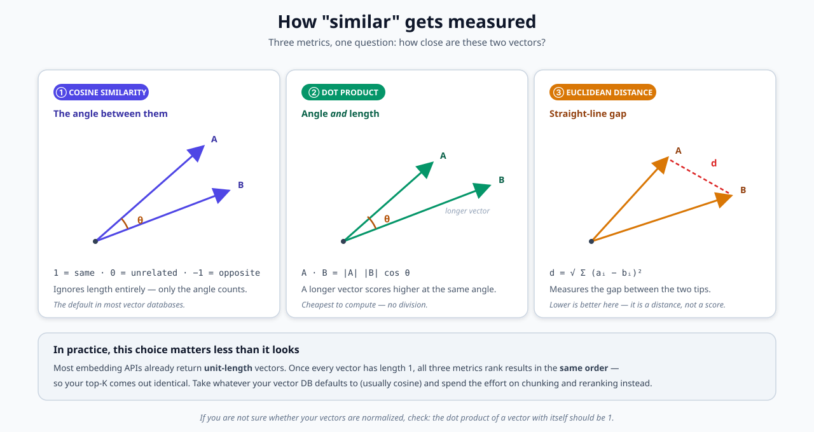
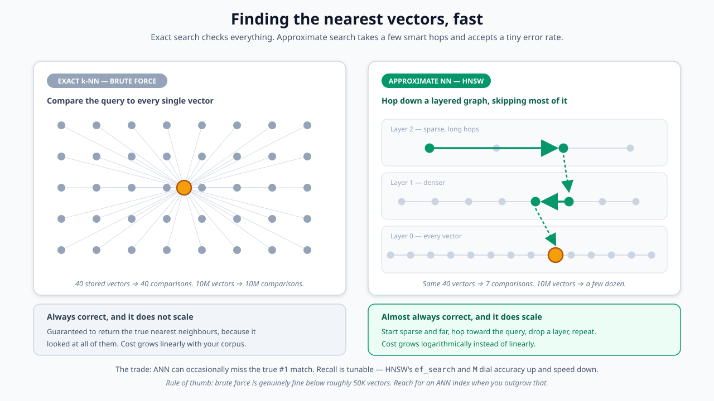

# Embeddings & Vector Search

> Turning text into numbers so machines can find "similar" meaning — the layer every RAG system, semantic search box, and recommendation feed is quietly built on.

**On this page:** [What it is](#what-it-is-in-one-paragraph) · [1. What an embedding is](#1-what-an-embedding-actually-is) · [2. The embedding space](#2-the-embedding-space) · [3. Measuring similarity](#3-measuring-similarity) · [4. Searching at scale](#4-searching-at-scale) · [Where embeddings fall down](#where-embeddings-fall-down) · [Choosing a model](#choosing-a-model) · [Glossary](#glossary)

**Related:** [RAG](../rag/README.md) puts embeddings to work · [Contextual Retrieval](../rag/contextual-retrieval.md) covers vector databases and chunk sizing in more depth.

---

## What it is, in one paragraph

Computers can't compare *meaning* — they compare numbers. An **embedding model** solves this by reading a piece of text and emitting a fixed-length list of numbers, positioned so that text with similar meaning gets similar numbers. Once your documents live in that numeric space, "find things like this" becomes a geometry problem: embed the query the same way, then look for the nearest points. That single trick is what makes semantic search, RAG retrieval, clustering, deduplication, and recommendation work.

---

## 1. What an embedding actually is

The model takes text in and returns a **vector** — a fixed-length list of floating-point numbers. Three things are worth internalizing:

- **The length is fixed by the model, not the input.** A three-word phrase and a 300-word paragraph both come out as (say) 1536 numbers. Longer text doesn't get a longer vector; it gets a blurrier one.
- **The individual numbers are meaningless.** There's no "dimension 42 = formality" you can read off. Only *distances between vectors* carry information.
- **Wording doesn't matter, meaning does.** "The cat sat on the mat" and "A feline rested on the rug" share almost no vocabulary, but land in nearly the same place. This is precisely what keyword search cannot do.

## 2. The embedding space

Picture every vector as a point in a very high-dimensional space. The model arranges that space during training so that **related meanings cluster together** — animals here, finance over there, programming down below.

Direction carries information too. The step from `man` to `king` is roughly the same step as from `woman` to `queen`, which is why the famous `king − man + woman ≈ queen` arithmetic works at all.

> **A caveat worth keeping:** analogy arithmetic is clean on classic *word* vectors and much shakier on modern *sentence* embeddings. Treat it as intuition for what the space is like, not as an operation to build on.

## 3. Measuring similarity

Three metrics show up constantly, and new engineers lose more time choosing between them than the choice deserves:

| Metric | Measures | Notes |
|---|---|---|
| **Cosine similarity** | The angle only | Length-independent. Range −1 to 1. The usual default. |
| **Dot product** | Angle **and** length | Cheapest to compute. Longer vectors score higher. |
| **Euclidean distance** | Straight-line gap | It's a *distance*, so lower is better. |

**The practical shortcut:** most embedding APIs already return **normalized** (unit-length) vectors. Once every vector has length 1, all three metrics produce the *same ranking* — so your top-K results are identical either way. Use whatever your vector database defaults to and spend the saved effort on chunking and reranking, which genuinely do change your results.

## 4. Searching at scale

Finding the nearest vectors is conceptually trivial — compare the query against everything and keep the closest. That's **exact k-NN**, it's always correct, and its cost grows linearly with your corpus. Fine at 10,000 vectors; unusable at 10 million.

**Approximate nearest neighbour (ANN)** indexes trade a sliver of accuracy for an enormous speedup. The dominant approach is **HNSW**: a layered graph where the top layer is sparse with long hops and the bottom layer contains everything. A search starts at the top, hops toward the query, drops a layer, and repeats — a few dozen comparisons instead of millions.

The trade is real but small and tunable: ANN can occasionally miss the true #1 match. HNSW's `ef_search` and `M` parameters dial recall up and speed down.

> **Rule of thumb:** brute force is genuinely fine below roughly 50K vectors. Don't reach for an ANN index — or a dedicated vector database — before you need one.

## Where embeddings fall down

Embeddings are strong at paraphrase and weak in ways that surprise people:

- **Exact identifiers.** Ticket `TS-999`, SKU codes, error numbers, surnames. Semantically these are near-noise, so the vector barely moves. This is exactly why serious retrieval systems run **BM25 keyword search alongside embeddings** — see [Contextual Retrieval](../rag/contextual-retrieval.md#embeddings-vs-bm25).
- **Negation.** "The drug is safe for children" and "The drug is not safe for children" embed *very* close together. Most models barely register the "not".
- **Long inputs.** Embed a 2,000-word document as one vector and you get the average of everything in it — a blurry centre of mass that matches nothing sharply. Chunk first.
- **Numbers and dates.** "revenue rose 3%" and "revenue rose 30%" are near-identical vectors. Don't expect retrieval to do arithmetic.
- **Domain jargon.** A general model may not know your internal vocabulary means something specific.

## Choosing a model

| Consideration | What to know |
|---|---|
| **Dimensions** | Bigger isn't automatically better — it's more storage and slower search. 768–1536 is the common sweet spot. |
| **Truncation** | Some models (e.g. `text-embedding-3`) let you shorten vectors and keep most of the quality, trading a little accuracy for real storage savings. |
| **Input limit** | Every model caps input tokens. Past the cap, text is silently truncated — a quiet source of bad retrieval. |
| **Query vs. document** | Some models expect an asymmetric prefix (`query:` / `passage:`). Skipping it measurably hurts recall. |
| **Cost** | Embedding is cheap per call but you pay for *every chunk* at index time and *every query* at runtime. |

**Two rules that save real pain:**

1. **Use the same model for indexing and querying.** Vectors from different models are not comparable — not even different sizes of the same family. Mixing them produces results that look plausible and are silently wrong.
2. **Changing models means re-embedding everything.** Budget for it. There is no migration path that avoids it.

## Glossary

| Term | Plain-English meaning |
|---|---|
| **Embedding** | A fixed-length list of numbers representing the *meaning* of a piece of text. |
| **Vector** | The list of numbers itself. |
| **Dimensions** | How many numbers are in each vector (e.g. 768, 1536). Set by the model. |
| **Embedding space** | The imaginary space all vectors live in, where distance means dissimilarity. |
| **Normalized vector** | A vector scaled to length 1, so only its direction matters. |
| **Cosine similarity** | Similarity measured as the angle between two vectors. |
| **Dot product** | Similarity accounting for both angle and length. |
| **Euclidean distance** | The straight-line gap between two vectors. Lower is closer. |
| **k-NN** | k Nearest Neighbours — the k closest vectors to a query. |
| **ANN** | Approximate Nearest Neighbour — fast search that trades a little accuracy for speed. |
| **HNSW** | The most common ANN index: a layered graph you traverse in a few hops. |
| **Recall** | The share of truly-relevant items the search actually returned. |
| **BM25** | Classic keyword scoring. Complements embeddings by catching exact strings. |

---

## What's in this folder

| File | What it covers |
|---|---|
| [`README.md`](README.md) | This page — embeddings and vector search from zero |
| [`diagrams/`](diagrams/) | The 4 source `.svg` diagrams, reusable on their own |

---

← Back to [all concepts](../README.md) · [home](../../README.md)
