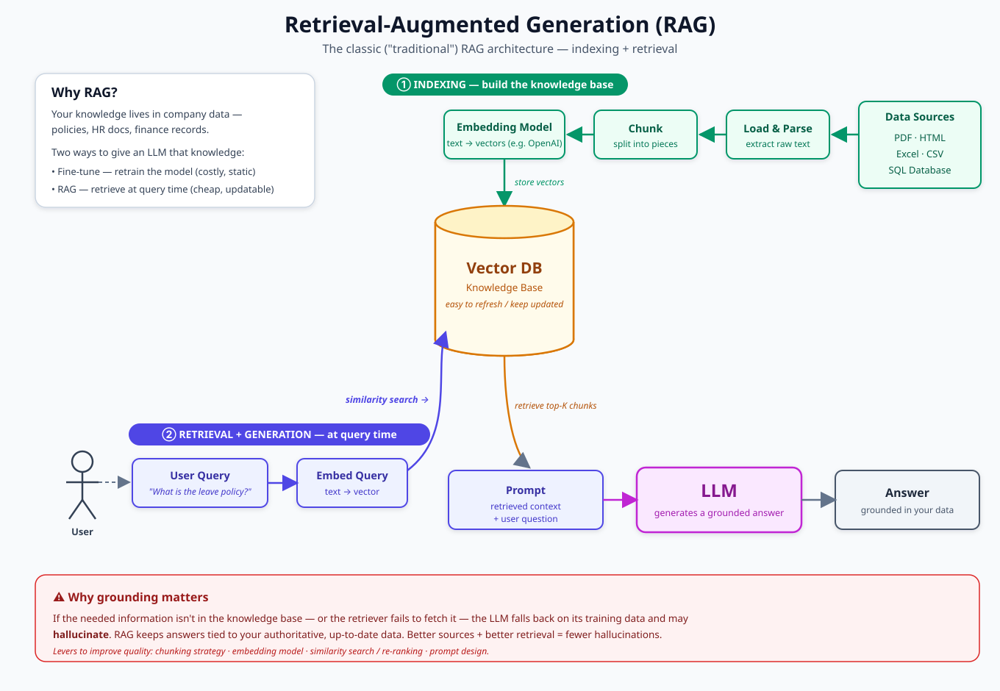

# Retrieval-Augmented Generation (RAG)

> How a language model answers questions using **your** data — instead of guessing from what it memorized during training.

---

## What it is, in one paragraph

Large Language Models are trained on huge amounts of general text, but they don't know your company handbook, your product docs, or anything that changed after their training cutoff. **RAG** fixes this: before the model answers, it **retrieves** the most relevant pieces of *your* knowledge base and hands them to the model as context. The model then answers grounded in that context. It's a cheap, fast alternative to retraining the model — and you can update the knowledge base any time.

---

## 1. The data flow

Where the data goes, end to end — from raw sources all the way to a grounded answer.

---

## 2. How it actually works — the two phases

RAG is really **two pipelines** that share one vector store.

### ① Indexing (offline — runs once, and on updates)
You prepare your knowledge *ahead of time*:

1. **Data Ingestion** — load your raw documents (PDF, HTML, Excel, SQL, etc.)
2. **Parsing** — extract clean text and split it into **chunks**
3. **Embedding** — convert each chunk into a **vector** (a list of numbers capturing its meaning)
4. **Store** — save those vectors in a **Vectorstore** (vector database)

### ② Retrieval + Generation (online — runs on every question)
1. **User query** comes in
2. The **Retriever** embeds the query and runs a **similarity search** against the Vectorstore
3. It pulls the **top-K most relevant chunks** — this becomes the **Context**
4. **Context + Query = Prompt**, which is sent to the **LLM**
5. The LLM produces a **grounded answer**

---

## The one idea to remember

**The LLM only ever sees the chunks the Retriever pulled.** The model is blind to everything else in your knowledge base.

- **Strong retrieval → grounded, accurate answers.**
- **Weak retrieval → the model fills the gaps and hallucinates.**

That's why, in practice, most of the engineering effort in a good RAG system goes into **retrieval quality** — chunking, embeddings, similarity search, and re-ranking — *not* the LLM itself.

---

## Glossary

| Term | Plain-English meaning |
|---|---|
| **Embedding** | A list of numbers representing the *meaning* of text, so similar meanings sit close together. |
| **Vector** | The list of numbers itself (one embedding). |
| **Vectorstore / Vector DB** | A database built to search vectors by similarity, fast. |
| **Chunk** | A small slice of a document (a paragraph or few sentences) that gets embedded and stored. |
| **Retriever** | The component that finds the most relevant chunks for a query. |
| **Similarity search** | Finding the stored vectors closest to the query vector. |
| **Top-K** | The K best-matching chunks the retriever returns (e.g. top 4). |
| **Context** | The retrieved chunks handed to the LLM. |
| **Prompt** | Context + the user's question, sent to the model. |
| **Hallucination** | When the model confidently states something false — often because it lacked the right context. |
| **Grounding** | Tying the model's answer to real, retrieved source data. |

---

← Back to [all concepts](../../)
