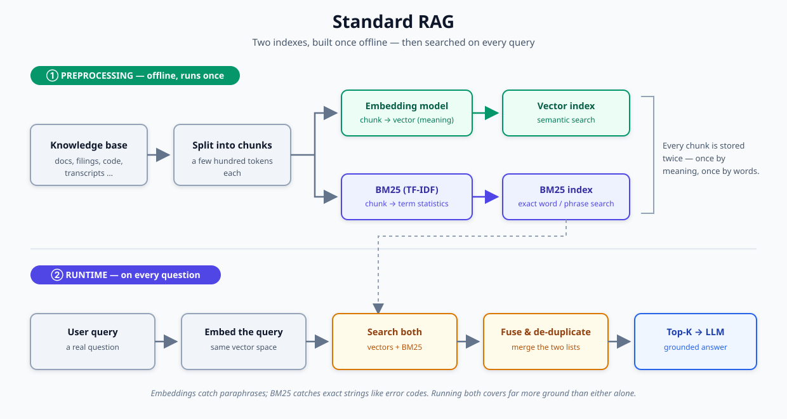
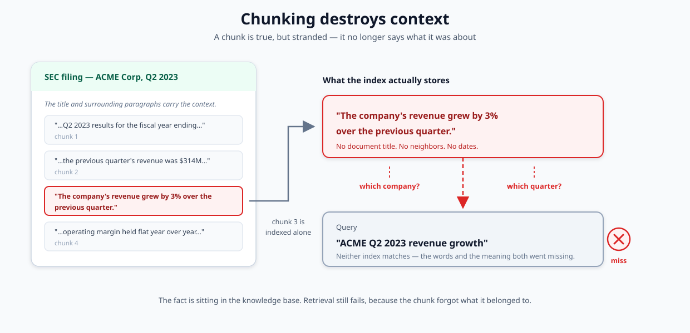
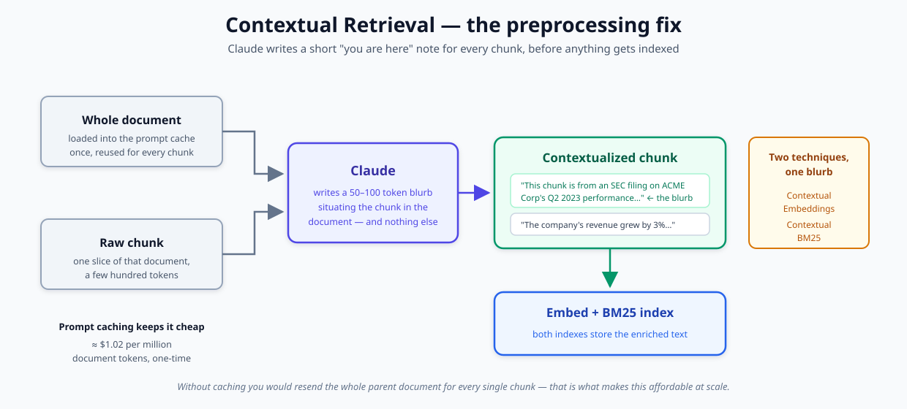
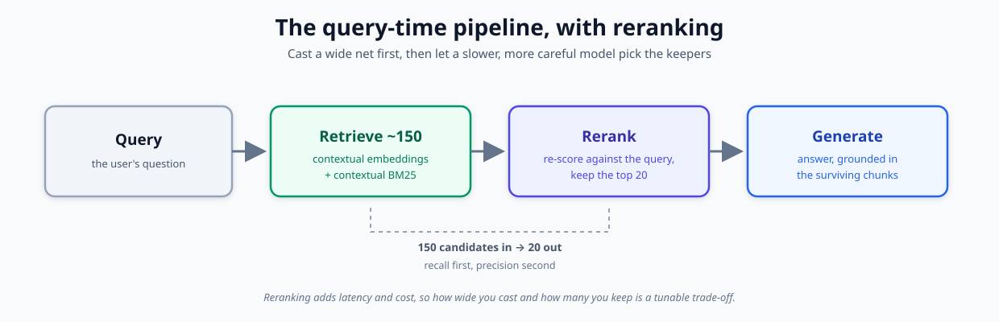
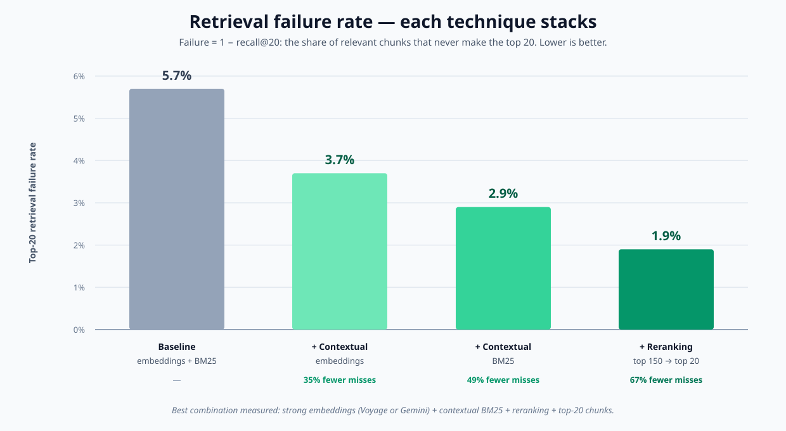
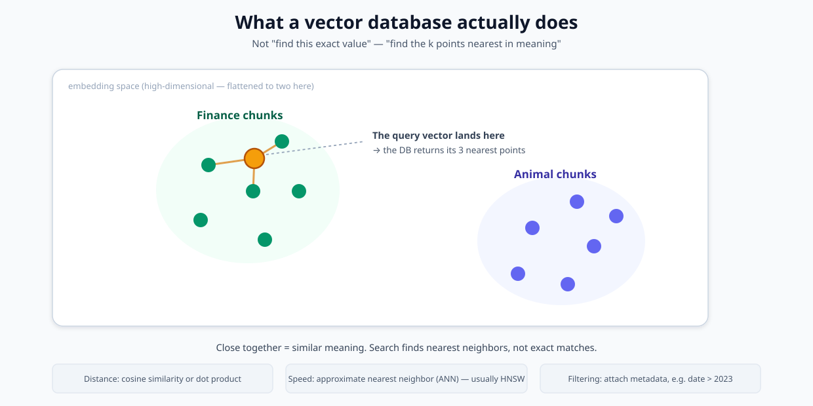
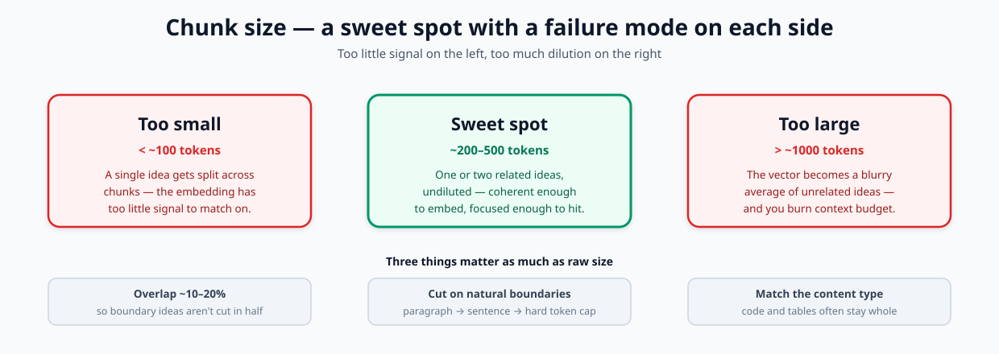

# Understanding Contextual Retrieval for RAG

> Study notes and diagrams on how Retrieval-Augmented Generation (RAG) works, why naive chunking hurts retrieval, and how **Contextual Retrieval** + **reranking** cut retrieval failures by up to ~67%.

These are my own notes, worked through end to end and rebuilt with original diagrams. Source material: Anthropic Engineering — *Introducing Contextual Retrieval* (September 19, 2024).

---

## Contents

- [The problem: models need background knowledge](#the-problem-models-need-background-knowledge)
- [Standard RAG](#standard-rag)
- [Embeddings vs. BM25](#embeddings-vs-bm25)
- [The flaw: chunking destroys context](#the-flaw-chunking-destroys-context)
- [The fix: Contextual Retrieval](#the-fix-contextual-retrieval)
- [Prompt caching keeps it cheap](#prompt-caching-keeps-it-cheap)
- [The final boost: reranking](#the-final-boost-reranking)
- [Results](#results)
- [Deep dive: vector databases](#deep-dive-vector-databases)
- [Deep dive: chunk sizing](#deep-dive-chunk-sizing)
- [Key takeaways](#key-takeaways)
- [Build it yourself](#build-it-yourself)

---

## The problem: models need background knowledge

A base model only knows what was in its training data. To make it useful in a specific context — a company's docs, a case history, your own notes — you feed the relevant background in at question time. Two ways to do that:

1. **Small knowledge base (< ~200K tokens, ~500 pages):** just put the whole thing in the prompt. Prompt caching makes this cheap and fast — no retrieval machinery needed.
2. **Larger knowledge base:** use **RAG** — retrieve only the relevant slices and append them to the prompt.

Everything below is about making step 2 retrieve *better*.

## Standard RAG

RAG has two phases: an offline **preprocessing** phase that builds a searchable index, and a **runtime** phase that answers each query. The preprocessing pipeline:



Split the corpus into chunks of a few hundred tokens, turn each chunk into **both** a semantic embedding and a BM25 lexical entry, and store both for search. At runtime you embed the user's question, pull the closest chunks from each index, fuse and de-duplicate them, and hand the top-K to the model.

## Embeddings vs. BM25

Two indexes because they fail in opposite ways:

| | Embeddings | BM25 |
|---|---|---|
| **Matches on** | Meaning (semantic similarity) | Exact words / phrases (lexical) |
| **Great at** | "these mean the same thing" | IDs, codes, technical terms |
| **Weakness** | Misses exact strings (e.g. `TS-999`) | Misses paraphrases |
| **Based on** | Vector distance | Refined TF-IDF (length-normalized) |

Running both and merging the results covers far more ground than either alone.

## The flaw: chunking destroys context

The insight the whole technique turns on. When you chop a document into small chunks, each chunk loses the surrounding context that told you what it was *about*:



The chunk *"revenue grew by 3% over the previous quarter"* is true but stranded — it no longer says **whose** revenue or **which** quarter. So a query like *"ACME Q2 2023 revenue growth"* fails to retrieve it, even though the fact is sitting right there in the knowledge base.

## The fix: Contextual Retrieval

Before indexing each chunk, prepend a short, chunk-specific blurb that situates it in its parent document. Both indexes then store the enriched text — that's the two sub-techniques: **Contextual Embeddings** and **Contextual BM25**.

```
Original chunk:
"The company's revenue grew by 3% over the previous quarter."

Contextualized chunk:
"This chunk is from an SEC filing on ACME Corp's Q2 2023 performance;
the previous quarter's revenue was $314 million.
The company's revenue grew by 3% over the previous quarter."
```

Who writes the blurbs for millions of chunks? Claude does, automatically:



The generation prompt is short — hand the model the whole document plus the one chunk, and ask for a succinct context that situates the chunk, and nothing else:

```
<document>{{WHOLE_DOCUMENT}}</document>
Here is the chunk we want to situate within the whole document:
<chunk>{{CHUNK_CONTENT}}</chunk>
Give a short, succinct context to situate this chunk within the overall
document for the purposes of improving search retrieval. Answer only with
the context and nothing else.
```

Each blurb is ~50–100 tokens, prepended before embedding and BM25 indexing.

## Prompt caching keeps it cheap

Naively, you'd resend the entire parent document with every chunk — enormous cost. Instead, load the document into the cache **once** and reference it for all its chunks. That brings the one-time cost to roughly **$1.02 per million document tokens** — cheap enough to run across a whole knowledge base.

## The final boost: reranking

The first retrieval pass returns many candidates of varying quality — sometimes hundreds. A **reranker** is a second, more careful model that re-scores those candidates against the query and keeps only the best:



The recipe: retrieve the top ~150, rerank, keep the top 20. It adds a little latency and cost, so it's a tunable trade-off.

## Results

Failure is measured as **1 − recall@20**: the share of relevant chunks that *fail* to appear in the top 20 retrieved. Lower is better. Each technique stacks:



| Configuration | Failure rate | Reduction vs. baseline |
|---|---|---|
| Baseline (embeddings + BM25) | 5.7% | — |
| + Contextual embeddings | 3.7% | 35% |
| + Contextual BM25 | 2.9% | 49% |
| + Reranking | 1.9% | 67% |

The winning combination: strong embeddings (Voyage or Gemini performed best) + contextual BM25 + reranking + top-20 chunks.

## Deep dive: vector databases

A relational database is built for exact-match and range queries (`WHERE price BETWEEN 10 AND 20`). A **vector database** answers a different question: *find the items most similar in meaning to this one.* It stores embeddings as points in a high-dimensional space, where similar meanings land near each other:



At query time: embed the question into the same space, then ask for the *k nearest points* (by cosine similarity or dot product). To stay fast at millions of vectors, these DBs use **approximate nearest neighbor (ANN)** indexes — most commonly **HNSW**, a layered graph you traverse in a few hops. "Approximate" is the trade: occasionally miss the true #1 match, in exchange for millisecond search.

Most vector DBs also let you attach **metadata** and filter on it — so you can combine `date > 2023` with similarity search. Options range from **pgvector** (a Postgres extension) to **Chroma** (lightweight, local) to managed services like **Pinecone**, **Weaviate**, and **Qdrant**.

> Mental model: a vector database is to *meaning* what a SQL index is to *exact values*.

## Deep dive: chunk sizing

There's a sweet spot with a clear failure mode on each side:



- **Too small:** a single idea gets split across chunks; the embedding has too little signal.
- **Too large:** the embedding averages several unrelated ideas into a blurry "center of mass," and you waste context budget.
- **Sweet spot (~200–500 tokens):** one or two related ideas, undiluted.

Three things matter as much as raw size:

1. **Overlap** — ~10–20% between neighbors, so an idea landing on a boundary isn't cut in half.
2. **Where you cut** — split on natural boundaries (paragraph → sentence → hard token cap), not blindly every N tokens.
3. **Content type** — dense reference text wants smaller chunks; narrative tolerates larger; code and tables often stay whole.

Contextual Retrieval actually *relaxes* the small-chunk problem: since each chunk now states which document and section it came from, smaller chunks no longer lose their bearings.

**Sensible default for a first build:** 400 tokens, 15% overlap, split on paragraph then sentence boundaries — then tune against a real eval set.

## Key takeaways

- Chunking makes documents searchable but **amnesiac** — each chunk forgets what it belonged to.
- **Contextual Retrieval** cures the amnesia by prepending a one-line "you are here" note to every chunk before indexing.
- **Prompt caching** makes that cheap enough to do at scale.
- Index the enriched chunks with **both** semantic (embeddings) and lexical (BM25) search, then **rerank** the survivors.
- Combined, these cut retrieval misses by roughly **two-thirds**.

## Build it yourself

A concrete project: build a baseline RAG in Python over a real corpus, add the contextual layer, and **measure recall@20 before/after** on your own eval set — showing a measured 30–60% retrieval improvement.

**Suggested stack (all have free tiers):**

| Piece | Options |
|---|---|
| Pipeline | LlamaIndex, LangChain |
| Vector store | pgvector (SQL + vectors in one), Chroma (local), Pinecone |
| Embeddings | Voyage, Gemini |
| Reranker | Cohere Rerank |
| Contextualizer | Claude (with prompt caching) |

---

*Notes compiled while studying Anthropic Engineering's "Introducing Contextual Retrieval" (Sep 19, 2024). Diagrams are original.*

---

← Back to [RAG](./README.md) · [all concepts](../README.md) · [home](../../README.md)
